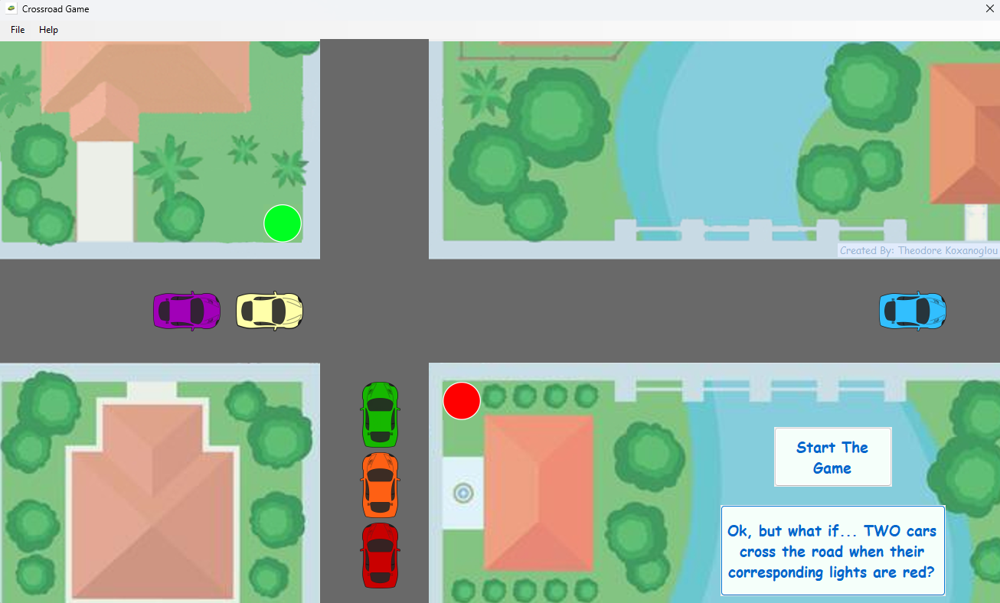

# Object-Oriented Application Development (2021) - Car Simulation

## Project Overview

This project is an individual assignment for the "Object-Oriented Application Development" course, offered in the 3rd semester of the 2021 academic year at the University of Piraeus, Department of Informatics. The goal is to create a Windows Forms application to simulate cars moving on two intersecting roads. The simulation involves managing car movements, traffic lights, and road intersections, with hardcoded speeds and traffic light timings. The application will demonstrate object-oriented programming principles and basic GUI development in a Windows environment.

## Course Information
- **Institution:** University of Piraeus
- **Department:** Department of Informatics
- **Course:** Object-Oriented Application Development (2021)
- **Semester:** 3rd

## Technologies Used

- C#

## Usage Examples

### Starting the Simulation
Click the "Start Simulation" button on the main form to begin the simulation of cars and traffic lights.

### Car Movement
Cars will move across the roads, reappearing at the beginning of the road after reaching the end. The speed of each car is predefined.

### Traffic Lights
Traffic lights control the flow of cars at the intersection:

- Green: Cars move freely.
- Yellow: Transition between green and red.
- Red: Cars stop if they haven't crossed the intersection.

## Setup Instructions

1. **Install Visual Studio:** Ensure you have Visual Studio installed on your system.
2. **Clone the Repository:** Clone the project repository from GitHub to your local machine.
3. **Open the Project:** Open the .sln file in Visual Studio.
4. **Build and Run:** Compile the project and run the application using Visual Studio.

## License

This project is licensed under the MIT License - see the [LICENSE](./LICENSE) file for details.
